# Importancia comercial y social de las principales hortalizas producidas en México

**Periodo analizado:** 2000 – 2023
**Fuente de datos:** FAO. 2025. *FAOSTAT — Crops and livestock products* (conjunto de datos QCL). Disponible en https://www.fao.org/faostat/en/#data/QCL
**Cultivos incluidos:** tomate, chile verde, cebolla, papa, pepino, brócoli y coliflor, calabaza, col, lechuga, ajo y espárrago. La papa, aunque FAOSTAT la clasifica como <<raíz y tubérculo>>, se incluye en este análisis por su uso común en México y su peso productivo (~2 Mt anuales).

---

## 1. México en el mapa mundial de las hortalizas

### 1.1 ¿Dónde se ubica México entre los productores mundiales?

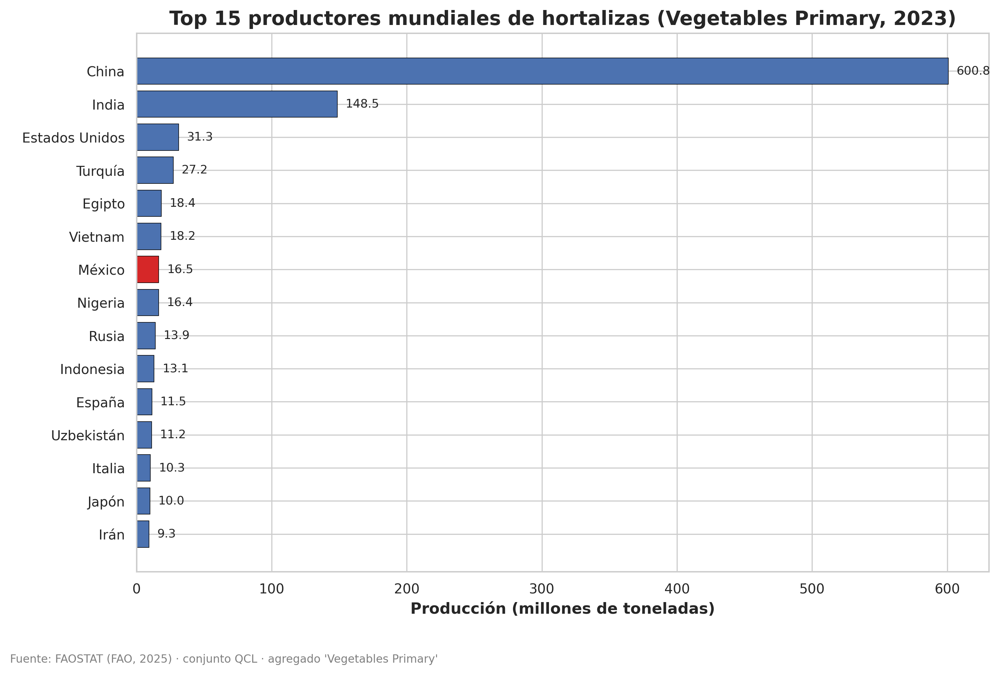

En 2023, **México fue el séptimo productor mundial de hortalizas**, con 16.5 Mt — apenas 1.4% del total mundial, pero por delante de países como Rusia, España, Italia o Japón. El panorama global está dominado por **China (600.8 Mt, > 50% del total mundial)** e India (148.5 Mt), seguidos por Estados Unidos (31.3 Mt) y Turquía (27.2 Mt).

### 1.2 Principales hortalizas producidas en México

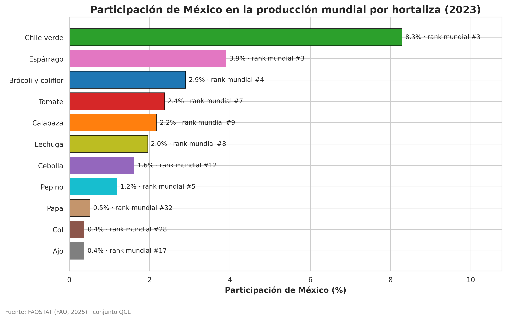

Esta figura demuestra que México es más un especialista de nicho que un productor promedio. Sólo tres cultivos colocan al país entre los cuatro primeros del mundo:

| Cultivo | Posición mundial | *Share* global |
|---|:-:|:-:|
| **Chile verde** | #3 | 8.3% |
| **Espárrago** | #3 | 3.9% |
| **Brócoli y coliflor** | #4 | 2.9% |
| Pepino | #5 | 1.2% |
| Tomate | #7 | 2.4% |
| Lechuga | #8 | 2.0% |
| Calabaza | #9 | 2.2% |

México es uno de los líderes mundiales en la producción de chile verde, lo cual es particularmente relevante dado el trasfondo cultural que existe alrededor de él. En cuanto al **espárrago y el brócoli**, estas son hortalizas que se exportan principalmente a Estados Unidos y Canadá. En el resto de cultivos, México queda fuera del *top* 10.

### 1.3 ¿Qué tan productivos somos comparados con el mundo?

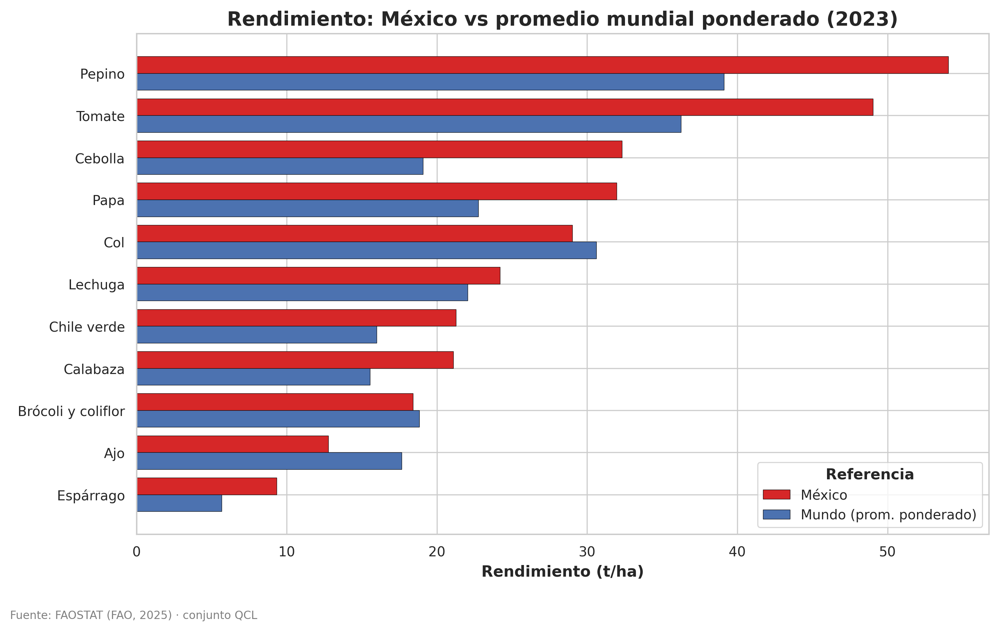

En la mayoría de las hortalizas, **México supera el promedio mundial ponderado** de rendimiento. El caso más impresionante es la **cebolla**, en donde tenemos 32 t/ha contra el promedio mundial, 19 t/ha; casi **70% más productivo**. El tomate (49 contra 36 t/ha) y el pepino (54 contra 39 t/ha) también muestran ventajas claras. Sólo en **ajo, col y papa** México queda por debajo del promedio mundial.

---

## 2. ¿Qué peso tienen las hortalizas dentro del contexto nacional?

Para posicionar a las hortalizas en el contexto de la producción vegetal nacional, comparé los agregados oficiales que publica la FAO: hortalizas (*Vegetables Primary*), frutas (*Fruit Primary*), cereales (*Cereals, primary*), leguminosas, raíces y tubérculos, oleaginosas, frutos secos y cultivos azucareros.

### 2.1 Producción por grupo de plantas (2023)

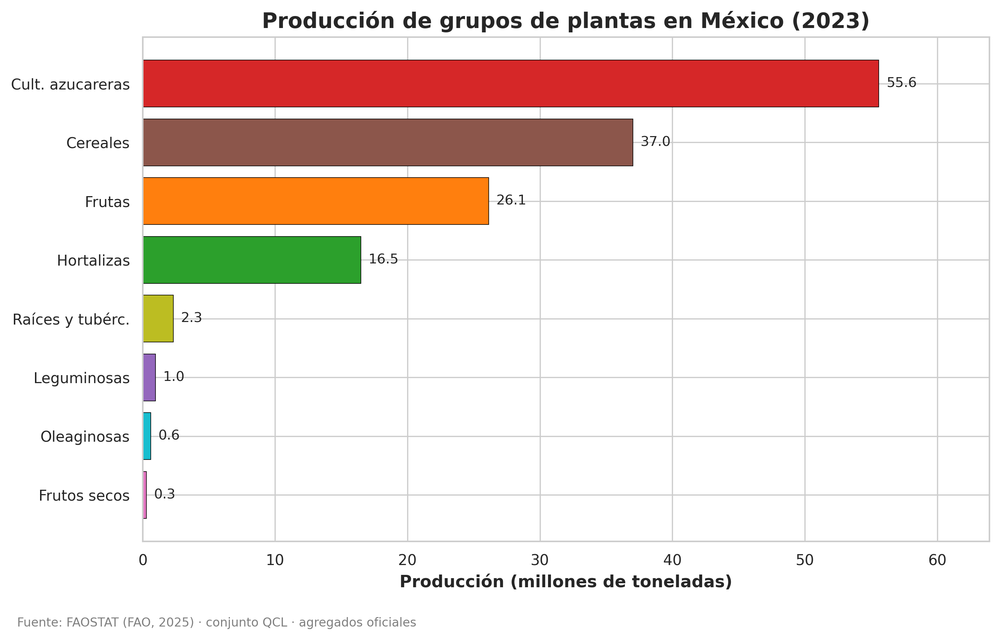

La producción nacional está dominada por **cultivos azucareros (55.6 Mt)** y **cereales (37.0 Mt)**, después están las **frutas (26.1 Mt)** y las **hortalizas (16.5 Mt)**.

### 2.2 Evolución de los grandes grupos

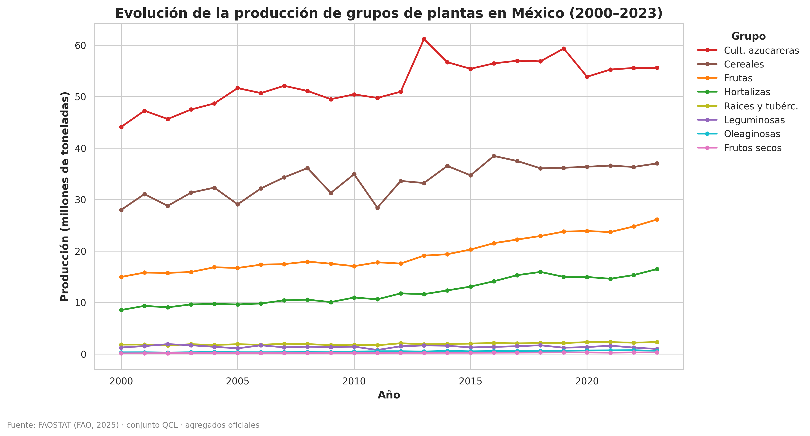

El crecimiento más acelerado en rendimiento se ha visto en las **hortalizas (+93%)** y las **frutas (+75%)**, las leguminosas incluso redujeron su producción en 23%.

### 2.3 Top 20 cultivos individuales

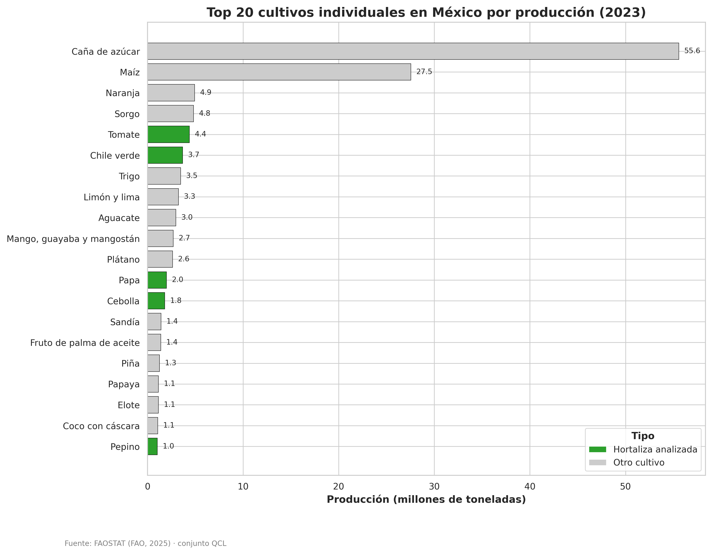

Cinco de nuestras once hortalizas están en el *top* 20 nacional: tomate (#5), chile verde (#6), papa (#12), cebolla (#13) y pepino (#20). Esto es notable porque compiten contra cultivos extensivos como la caña, el maíz, el sorgo y los frutales mayores (cítricos, mango, plátano, aguacate). El tomate, en particular, **supera en producción al trigo y al aguacate**.

---

## 3. Producción anual de las 11 hortalizas (2000–2023)

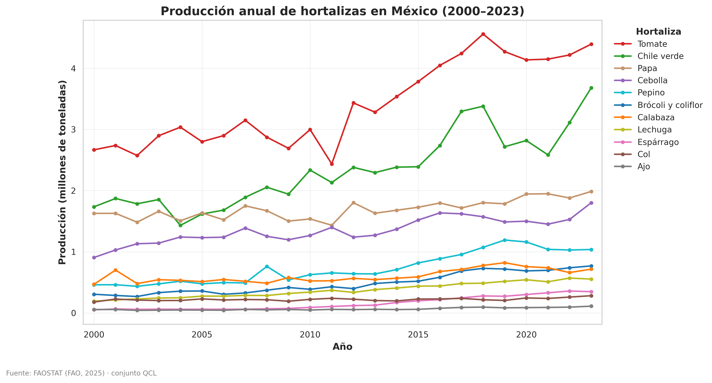

La gráfica de líneas evidencia la **dominancia del tomate**: en el año 2000 tenía una producción de ~2.6 Mt en, y para 2023 alcanza las **4.39 Mt**, con una tendencia claramente ascendente. Después está el chile verde, con un crecimiento notable a partir de 2014.

Por debajo, la papa y la cebolla tienen crecimientos sostenidos pero más moderados (cerca de 1.8–2.0 Mt cada una). El pepino, brócoli, coliflor, calabaza y lechuga, duplicaron su producción en el periodo analizado. El ajo mantiene la tendencia de ser la hortaliza de menor volumen a nivel nacional.

---

## 4. *Ranking* en el año más reciente disponible (2023)

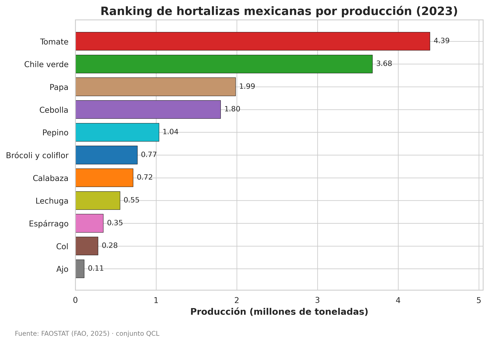

El tomate y el chile verde tuvieron, en 2023, casi **8.1 Mt**; más que las otras nueve hortalizas combinadas. La papa y la cebolla están en tercer lugar, con casi 1.9 Mt cada una, y el pepino es la quinta hortaliza más producida.

> Siete de las once hortalizas (tomate, chile, papa, cebolla, pepino, brócoli/coliflor y calabaza) superan ya el medio millón de toneladas anuales, un umbral que México no alcanzaba ni siquiera para sus cultivos emblemáticos hace dos décadas.

---

## 5. Participación relativa en las hortalizas nacionales

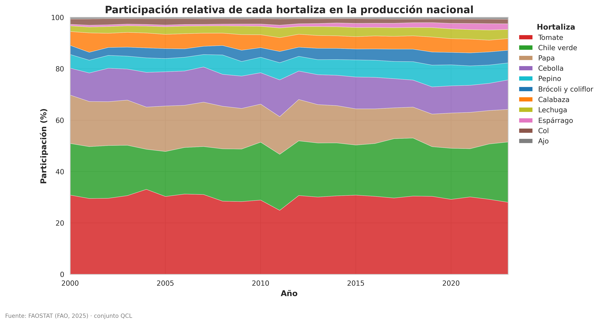

El gráfico apilado nos permite ver cómo se reparte cada año la producción dentro del grupo de hortalizas analizadas. El tomate aporta entre el 30 y 40% de cada año, el chile verde representa el 22-27%. México concentra su producción de hortalizas en tomate, chile, papa y cebolla, y no se observa una sustitución entre cultivos a lo largo de los años.

---

## 6. Rendimiento (productividad por hectárea)

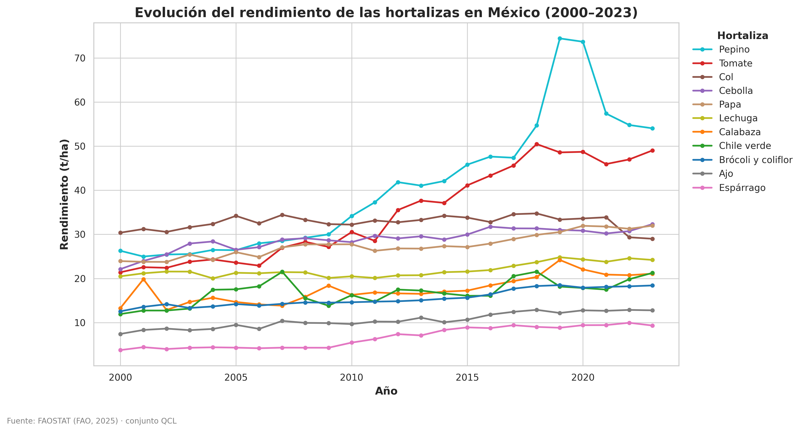

El **pepino es el cultivo de mayor productividad por unidad de superficie**, con un pico cercano a **75 t/ha en 2019–2020**. El tomate también muestra un salto sostenido, pasando de ~22 t/ha a casi 50 t/ha. Estos saltos en rendimiento son la clave que explica por qué la producción se ha duplicado mientras la superficie cosechada apenas crece.

En el otro extremo, el espárrago y el ajo presentan rendimientos modestos (< 15 t/ha), **posiblemente** atribuibles a la naturaleza biológica de estos cultivos, no por deficiencias agronómicas.

---

## 7. Cultivos de gran extensión contra cultivos intensivos

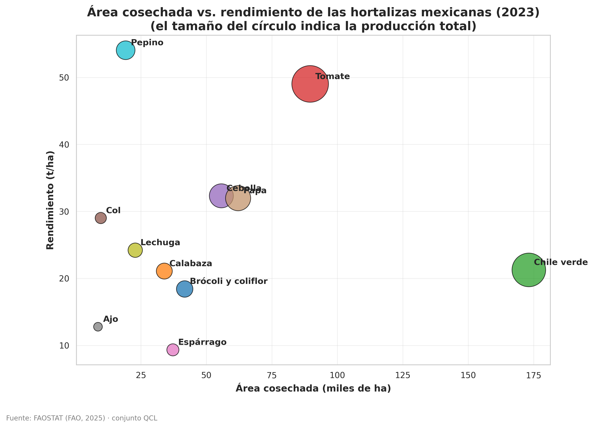

El tamaño del círculo indica la producción total del cultivo. Este gráfico de burbujas en 2023 confirma que el tomate y el chile verde son las dos hortalizas más cultivadas en México.

---

## 8. Crecimiento porcentual de la producción (2000–2002 vs. 2021–2023)

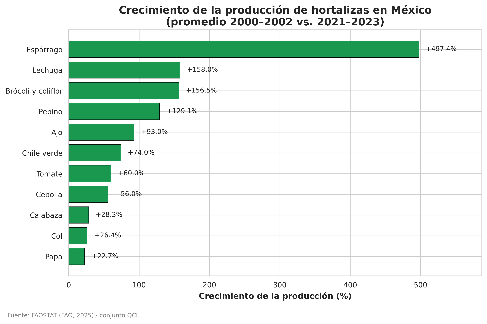

Comparando los promedios de los tres primeros años con los de los tres últimos, todos los cultivos crecieron, pero a velocidades diferentes:

| Crecimiento | Cultivos |
|---|---|
| > 150% | espárrago (+497%), lechuga (+158%), brócoli/coliflor (+157%) |
| 50–150% | pepino (+129%), ajo (+93%), chile verde (+74%), tomate (+60%), cebolla (+56%) |
| < 30% | calabaza (+28%), col (+26%), papa (+23%) |

México pasó de ser un productor menor de **espárrago**, a ser **uno de los principales proveedores mundiales**.

---

## 9. Mapa de calor

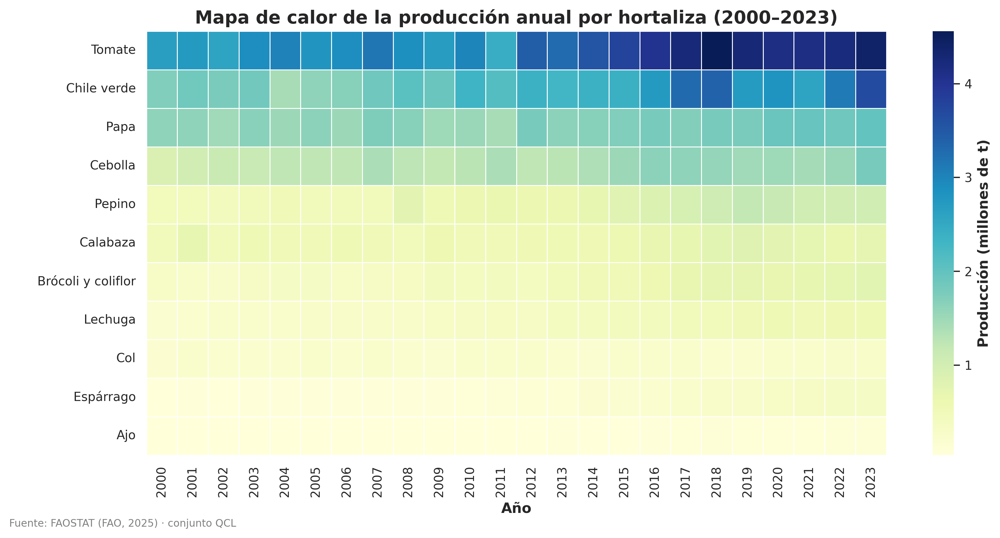

El mapa de calor muestra las once hortalizas y los 24 años analizados. Nos permite identificar:

- La expansión continua del tomate.
- El despegue del chile verde a partir de 2014.
- La caída de 2011 en tomate y chile.
- La estabilidad histórica del ajo y la col.

---

## 10. Tabla resumen

| Hortaliza | Producción promedio (t) | Área promedio (ha) | Rendimiento promedio (t/ha) | Producción 2023 (t) |
|---|---:|---:|---:|---:|
| Tomate | 3 408 943 | 101 819 | 34.70 | 4 394 807 |
| Chile verde | 2 337 558 | 138 444 | 16.91 | 3 681 062 |
| Papa | 1 693 771 | 61 642 | 27.54 | 1 986 199 |
| Cebolla | 1 350 354 | 46 536 | 28.88 | 1 801 137 |
| Pepino | 731 781 | 18 151 | 40.72 | 1 036 717 |
| Calabaza | 605 404 | 34 601 | 17.53 | 715 773 |
| Brócoli y coliflor | 485 035 | 30 476 | 15.52 | 768 354 |
| Lechuga | 372 034 | 16 786 | 21.90 | 552 940 |
| Col | 220 836 | 6 788 | 32.65 | 281 004 |
| Espárrago | 157 090 | 21 147 | 6.66 | 347 291 |
| Ajo | 64 793 | 6 081 | 10.49 | 110 110 |

La versión completa con columnas adicionales está en `figuras/tabla_resumen_hortalizas.csv`.

---

## 11. Discusiones

Podemos agrupar a las hortalizas mexicanas en dos grupos. Por un lado, los cultivos de alto valor de exportación (tomate, pepino, espárrago y brócoli) que han multiplicado su productividad y han llevado al país a colocarse entre los primeros del mundo en su categoría; y por otro, aquellos cultivos de fuerte arraigo cultural y social (chile, cebolla, papa, calabaza y ajo), que son una parte muy importante de la dieta nacional.


## 11. Conclusiones

1. México es el productor mundial #7 de hortalizas, pero el #3 en chile verde y espárrago, #4 en brócoli y #5 en pepino; esto podría sugerir una estrategia de especialización agrícola, con el beneficio de las ventajas climáticas y la cercanía con E.U.A. y Canadá.
2. Las hortalizas (+93%) y frutas (+75%) crecieron casi al triple del ritmo que los cereales (+32%) y azucareras (+26%).
3. El tomate y el chile verde dominan la producción nacional, aportando casi el 50% de la producción nacional de las hortalizas estudiadas; esto es un reflejo de su importancia social, cultural y gastronómica.
4. Los rendimientos del pepino y del tomate se han duplicado o triplicado desde el año 2000, superando en la mayoría de casos el promedio mundial. Esto podría ser atribuible a que se han implementado estrategias de agricultura protegida, agricultura de precisión y/o agroecología.

---

### Reproducibilidad

Todo el análisis es reproducible ejecutando:

```bash
python3 analisis_hortalizas.py
```

Las figuras se colocan en la carpeta `figuras/` y el CSV de resumen en `figuras/tabla_resumen_hortalizas.csv`.

**Cómo citar:**

FAO, (2025). *FAOSTAT — Crops and Livestock Products*. Disponible en https://www.fao.org/faostat/en/#data/QCL. Recuperado el 12 de mayo de 2026.

Castañeda-Martínez, R. (2026). Importancia_hortalizas: Análisis de los datos proporcionados por la FAOSTAT sobre la importancia comercial de las hortalizas mexicanas [Software]. GitHub. https://github.com/ruben1294/Importancia_hortalizas

---

### Declaración sobre uso ético de modelos de lenguaje grande (LLMs)

Claude Code (Anthropic, modelo Opus 4.7) me ayudó a realizar una parte de la codificación en *Python*, la recuperación de los datos usados para el análisis, la generación del formato original de este documento y el pulido de redacción del documento final. El *debugging*, la redacción principal y las ideas originales del análisis recaen en el autor.
